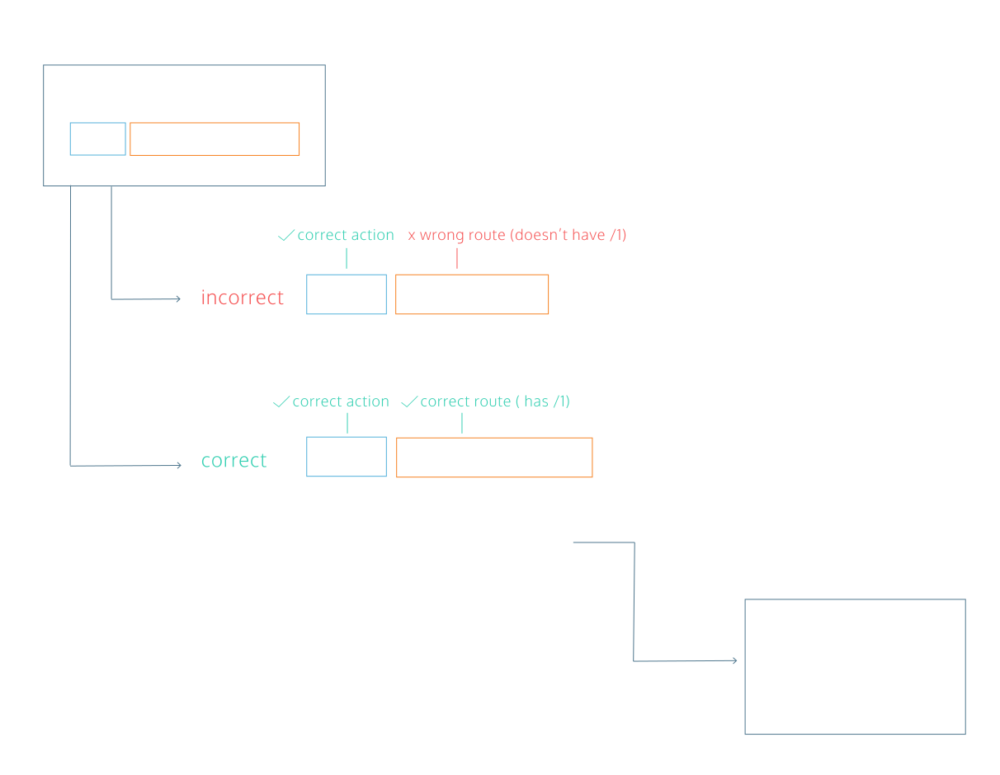

# Matching Longer Paths

Parameters are extremely helpful in making server routes dynamic and able to respond to different inputs. Route parameters will match anything in their specific part of the path, so a route matching /monsters/:name would match all the following request paths:

`
/monsters/hydra
/monsters/jörmungandr
/monsters/manticore
/monsters/123
`

In order for a request to match a route path, it must match the entire path, as shown in the diagram to the right. The request arrives for /expressions/1. It first tries to match the /expressions route, but because it has additional path segments after /expressions, it does not match this route and moves on to the next. It matches /expressions/:id because :id will match any value at that level of the path segment. The route matches, so the Express server calls the callback function, which in turn handles the request and sends a response.

