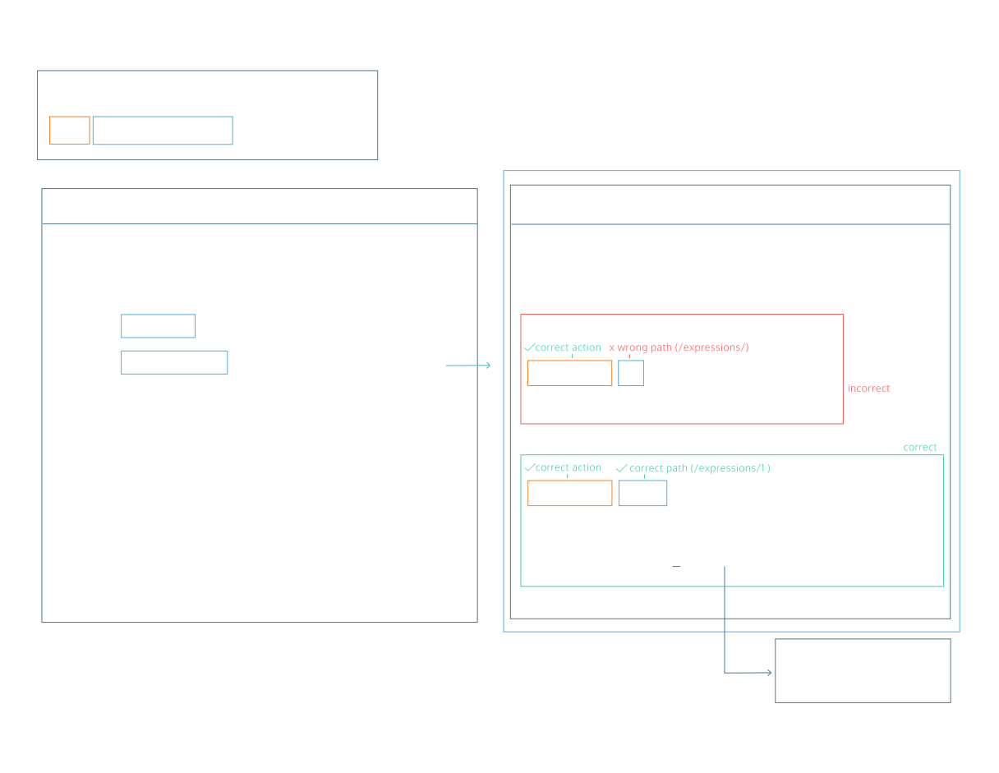

# Matching In Nested Routers

As you saw in the previous exercise, when using routers, it’s important to remember that the full path of a request can be segmented.

In the provided diagram, you can see an Express application using two routers. A GET request arrives for /expressions/1. Because the beginning of the path does not match /animals in the first app.use(), the Express server moves on to the next app.use(), which matches /expressions.

Express’s route matching algorithm then enters the expressionsRouter instance which is required from expressions.js. Inside this router, the path matching changes. Even though the whole request path is /expressions/1, inside the expressionsRouter, all paths are matched from the parts of the path after /expressions, meaning that in this context, the router is trying to match the path /1.

Because the path is /1, the path does not match the first .get() method at /. The Express server moves on to the next route, which has a route parameter of /:id, so it matches! This route handles the necessary logic and sends the response.

Routers can be nested as many times as necessary for an application, so understanding nested route matching is important for creating complicated APIs.

