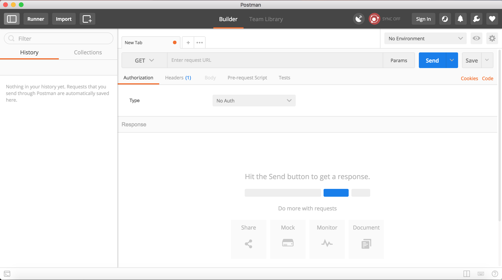
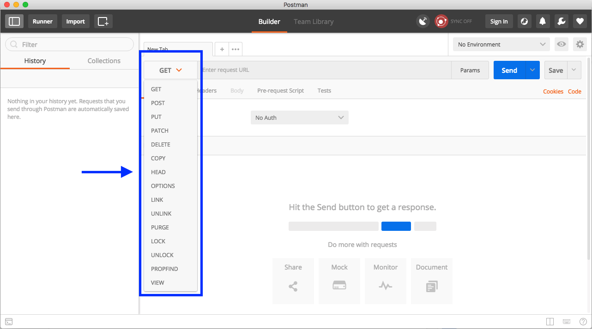
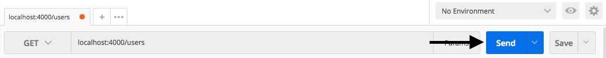
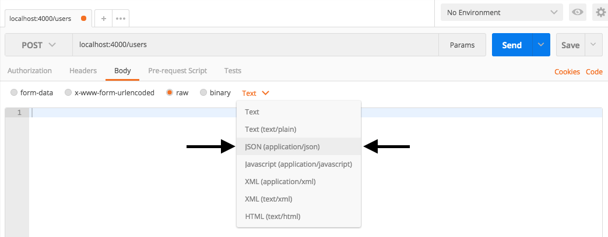
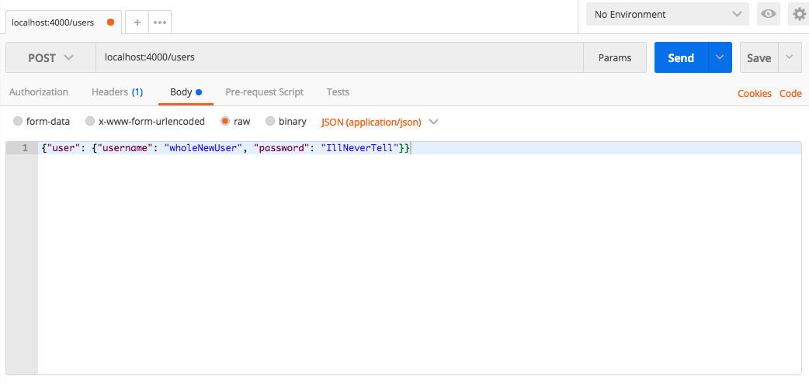

# Setting Up Postman

Get Postman setup on your computer so that you can start testing API requests with ease.

## The Postman App

Postman is a GUI that aids in the development of APIs by making it easy to test requests and their responses in an organized way. Everything you can do in Postman you can also do through the command line, but Postman makes the process quicker and easier by providing a clean interface and powerful set of tools.

### Download/Installation

You can download the App for free at Get [Postman](https://www.getpostman.com/). Choose the package for your operating system, and then unzip it to install.

### Setting up our Example Backend

We have created a simple backend that you can interact with to get comfortable with making HTTP requests. This backend uses a SQLite database to store users. Each user has only a username (String) and a password (String). For now, we only have the GET and POST requests set up.

Follow these steps to get the example backend set up:

- Download the example backend directory [here](https://content.codecademy.com/courses/apis/example_backend.zip?_gl=1*320ous*_ga*MjUyMjQwODQ5MC4xNjkzOTIxMDI3*_ga_3LRZM6TM9L*MTcwMTk5MTQ0Mi4xNS4xLjE3MDE5OTE2MTYuNjAuMC4w).
- Unzip the file.
- Navigate into the directory through your command line (use cd example_backend from whichever directory you unzipped it into).
- Make sure you have Node installed. To check, you can run npm -v on your command line. If you see a version number, you have Node. If the npm command is not found, you should follow these steps to install Node.
- Run npm install from inside the example_backend directory to install all of the project’s dependencies.
- To start the server, run node server.js from inside the example_backend directory. Now, this simple server should be running at <http://localhost:4000>.

Next, we’ll see how to interact with this server using Postman.

## Making GET Requests with Postman

With the example backend running at localhost:4000, open the Postman App. You should see an interface that looks like this:



At the top of the window, you can see a dropdown that lets you choose what kind of HTTP operation to perform. By default, it is set to GET. If you expand the dropdown, you will see all of the possible HTTP methods you can use to interact with this system:


To see all of the users that are currently in the database, make a GET request to localhost:4000/users. To do this, you should:

Make sure the dropdown is set to GET.
Enter the URL localhost:4000/users in the textbox that says “Enter request URL”.
When the you have entered this information, press the Send button:



The body of the response will appear in the panel at the bottom of the window. You should see two users stored, each with a unique id:

```JSON
{
    "users": [
        {
            "id": 1,
            "username": "1lameuser",
            "password": "secret_password"
        },
        {
            "id": 2,
            "username": "cool_user_87",
            "password": "notPassword!"
        }
   ]
}
```

This tells us that there are currently two users stored in the database. One has a username with the value “1lameuser” and a password with the value “secret_password”, and the other has a username with the value “cool_user_87” and a password with the value “notPassword!”.

We can also GET a specific user by specifying an id in the URL of the GET request. To get the user “1lameuser”, for example, we can send this GET request: localhost:4000/users/1. The response to this request should be:

```JSON
{
    "user": {
        "id": 1,
        "username": "1lameuser",
        "password": "secret_password"
    }
}
```

These GET requests only retrieved resources from the server. No information was changed. Next, we’ll look at how to use Postman to send requests to add users to the system.

## Making POST Requests with Postman

We can use POST requests to add users to the database. Let’s practice with sending some POST requests.

- Change the type of request from GET to POST using Postman’s dropdown selector.

- Add the request URL (localhost:4000/users) in the appropriate textbox.

- In order to create a new resource in this database, we need to supply a user object to create in the body of the POST request. Select the “Body” tab and check the “raw” radio button to specify input.

- The type of input should be a JSON object, so select the dropdown that says “Text” and change it to “JSON (application/json)”:



In the text input field underneath the radio buttons, type in whatever user object you want to add. For a valid POST request for this server, you should include JSON in the request body that has this format:

`{"user": {"username":<String>, "password":<String>}}`

Here is an example of what the interface will look like before you send the request:



Press the Send button to send the POST request.

Look at the output. What is contained in the response body? Is this what you would expect? For the above example, the output in the response body looks like:

```JSON
{
    "user": {
        "id": 3,
        "username": "wholeNewUser",
        "password": "IllNeverTell"
    }
}
```

This response means that a user with username “wholeNewUser”, password “IllNeverTell”, and id 3 was added to the users resource.

## More Practice with Requests

Let’s try sending some more requests.

- Add a user to the system with your first name (as a String) as the username and your last name (as a String) as the password. Use POST to do this, with a user object in the body as a JSON.
- Look at all of the users contained in the users resource now. Use a GET request to do this.
- Retrieve the user with id 4 only. Use a GET request with a specified id to do this.
Great work! You now can use Postman to make requests and see the corresponding responses. This will be very helpful in testing and understanding the APIs you build.
